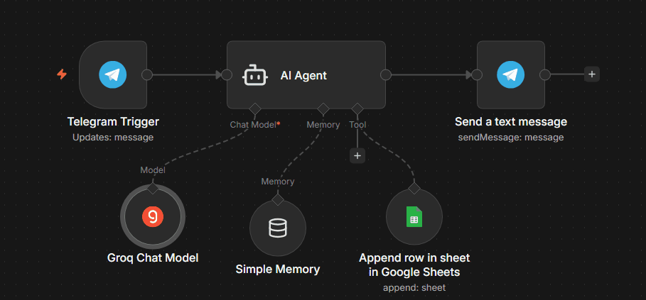

<h1 align="center">Financial Controller 💵</h1>

 Turn your Telegram into a personal finance assistant. Send your expenses in natural language (e.g., 'Spent $50 on gas'), and let the AI organize and input the values straight into your Google Sheets.

  
  <a href="#-screenshots">Screenshots</a>&nbsp;&nbsp;&nbsp;|&nbsp;&nbsp;&nbsp;
  <a href="#-overview">Overview</a>&nbsp;&nbsp;&nbsp;|&nbsp;&nbsp;&nbsp;
  <a href="#-tools">Tools</a>&nbsp;&nbsp;&nbsp;|&nbsp;&nbsp;&nbsp;
  <a href="#-how-to-run">How to Run</a>&nbsp;&nbsp;&nbsp;|&nbsp;&nbsp;&nbsp;
  <a href="#-project">Project</a>&nbsp;&nbsp;&nbsp;|&nbsp;&nbsp;&nbsp;
  <a href="#-license">License</a>&nbsp;&nbsp;&nbsp;|&nbsp;&nbsp;&nbsp;
  <a href="#-contributing">Contributing</a>&nbsp;&nbsp;&nbsp;|&nbsp;&nbsp;&nbsp;
  <a href="#support">Support</a>  

 

## 📸 Screenshots

 

## 🔗 Overview

* **Telegram Bot API:** The chat interface for user interaction.
* **Groq Chat Model:** Low-latency AI engine (LPU) for near-instant response times.
* **n8n AI Agent:** The orchestrator that connects the LLM with external tools.
* **Simple Memory:** Memory buffer to maintain context throughout the conversation.
* **Google Sheets Tool:** Acts as a lightweight database for logging information collected by the agent.

 

## 🛠 Tools

- [n8n](https://n8n.io/) – Automation workflow tool
- Telegram Bot API
- Groq Chat Model 
- n8n AI Agent 
- Simple Memory
- Google Sheets Tool

 

## ⚙ How to Run

1. Prepare External APIs
* **Telegram:** Search for `@BotFather` on Telegram, create a new bot, and save the `API Token`.
* **Groq:** Go to the [Groq Cloud Console](https://console.groq.com/), sign up, and generate an `API Key`.
* **Google Sheets:** Create a new spreadsheet and copy its ID from the URL. Set up your column headers in the first row.

2. Import the Workflow
* In n8n, go to **Workflows** > **Import from File** and upload the JSON file from this repository.

3. Configure Credentials in n8n
* **Telegram Receiver:** Create a new credential and paste your `Access Token`.
* **Groq Chat Model:** Create a new `Groq API` credential and paste your key.
* **Google Sheets:** Set up a `Google Sheets OAuth2 API` credential to link your Google account.

4. Node Configuration
* In the **Google Sheets node**, select your spreadsheet and map the data to the correct columns.
* In the **Groq Chat Model node**, ensure an active model is selected (e.g., `llama3-70b-8192`).

5. Deployment
* Click **Execute Workflow** to run a manual test.
* If everything works, toggle the **Publish** button (top right) to keep the bot active 24/7.

 

## 💻 Project

These workflows were created as part of a practical study plan in n8n, aiming to master process automation and AI agent orchestration.

 

 

## 🫱🏻‍🫲🏻 Contributing

 Contributions, issues, and feature requests are welcome! Please, feel free to do it! 😉 

 

## 📜 License

* This project is licensed under the [MIT License](https://choosealicense.com/licenses/mit/)
